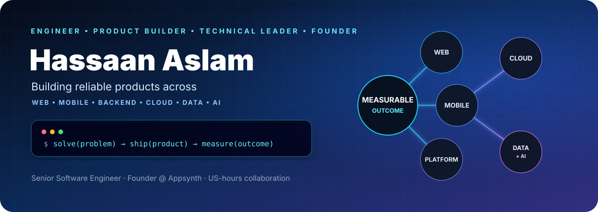
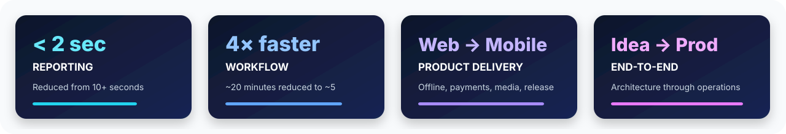

<div align="center">



<a href="https://git.io/typing-svg"></a>

[](https://appsynth.co/)
[](https://www.linkedin.com/in/hassaan-aslam/)
[](https://github.com/hassaanaslam)

</div>

## Engineering products that move businesses forward

I’m a senior software engineer and delivery leader working across **web, mobile, backend, cloud, data, and AI-enabled products**. I help founders, CTOs, and product teams turn difficult technical problems into dependable production outcomes.

I work hands-on across architecture and implementation, while also leading [Appsynth](https://appsynth.co/)—an engineering company providing embedded developers and managed product teams.

<table>
<tr>
<td width="33%" valign="top">

### 🚀 Build

SaaS platforms, web and mobile products, APIs, real-time systems, data workflows, and AI-enabled features.

</td>
<td width="33%" valign="top">

### ⚙️ Modernize

Legacy applications, slow queries, fragile deployments, outdated infrastructure, and difficult integrations.

</td>
<td width="33%" valign="top">

### 📈 Accelerate

Delayed roadmaps through technical leadership, embedded engineers, or a focused product-delivery team.

</td>
</tr>
</table>

## Proof, not buzzwords



| Problem | What I changed | Improvement |
| --- | --- | --- |
| PostgreSQL reports and pages were slow enough to interrupt operational work | Optimized queries, introduced materialized views, and redesigned data-access paths | **50%+ faster loads** across affected paths; one report improved from **10+ seconds to under 2 seconds** |
| A reporting workflow took roughly 20 minutes | Reworked its query and processing architecture | Reduced execution to **about 5 minutes**—approximately **4× faster** |
| Older Phoenix/OTP applications carried upgrade and reliability risk | Upgraded frameworks and runtimes; modernized PubSub, ETS/Registry, Presence, and releases | Safer deployments, current runtime support, and more reliable real-time behavior |
| Parser, transformer, and orchestration services were difficult to deploy consistently | Built Python ETL services using AWS ECS/ECR, Docker, serverless orchestration, CI/CD, and monitoring | More repeatable delivery, clearer service boundaries, and easier operations |
| Mobile workflows needed to function with unreliable connectivity | Led React Native delivery with offline support, media, notifications, payments, authentication, and store releases | Dependable real-world workflows and sustained production delivery |
| Customer journeys depended on many sensitive integrations | Built GraphQL/REST APIs, WebSockets, passwordless authentication, Stripe, SMS, CAPTCHA, and S3 workflows | Expanded product capability while keeping integrations maintainable |

## Selected work

> Commercial details are summarized to respect client confidentiality.

<table>
<tr>
<td width="50%" valign="top">

### Operational SaaS platform

Built React and Phoenix capabilities for mobile ordering, real-time updates, operational dashboards, and reporting. Improved slow reporting through PostgreSQL query design and materialized views.

**Stack:** React · Elixir/Phoenix · LiveView · PostgreSQL · WebSockets

</td>
<td width="50%" valign="top">

### Cloud ETL platform

Built and operated parsing, transformation, scripting, orchestration, and data-mashing services with repeatable cloud delivery.

**Stack:** Python · AWS ECS/ECR · Lambda · Docker · CI/CD

</td>
</tr>
<tr>
<td width="50%" valign="top">

### Production mobile products

Led delivery for React Native products supporting offline operation, camera and media workflows, notifications, payments, authentication, and app-store releases.

**Stack:** React Native · Expo · Node.js · Native integrations

</td>
<td width="50%" valign="top">

### Platform modernization

Modernized legacy umbrella applications across framework upgrades, PubSub, Presence, process coordination, state machines, containerized development, and release workflows.

**Stack:** Elixir/OTP · Phoenix · Rails · Docker · AWS

</td>
</tr>
<tr>
<td width="50%" valign="top">

### Real-time coaching and workflow systems

Delivered GraphQL services, passwordless authentication, responsive client/server flows, real-time communication, and secure product integrations.

**Stack:** Absinthe · GraphQL · Next.js · Apollo · Phoenix

</td>
<td width="50%" valign="top">

### Integrated customer platforms

Implemented SMS, CAPTCHA, S3 uploads, Stripe payments, authentication, Presence, and supporting backend workflows in production applications.

**Stack:** Phoenix · PostgreSQL · AWS S3 · Stripe · SMS

</td>
</tr>
</table>

## Technology radar

<div align="center">

### Product


### Systems and data


### Cloud and delivery


</div>

## Product domains

`SaaS operations` · `Mobile commerce` · `Field workflows` · `Healthcare` · `Delivery and logistics` · `Sports analytics` · `Coaching platforms` · `Data pipelines` · `AI-enabled work management`

## How I work

```text
Understand the outcome → reduce uncertainty → deliver in small increments → measure → improve
```

- Business context before technology selection
- Clear communication about risks and tradeoffs
- Incremental modernization instead of unnecessary rewrites
- Reliability, maintainability, and operational visibility
- Comfortable collaboration with distributed teams and US working hours

---

<div align="center">

## Have a product or delivery problem worth solving?

For senior engineering and technical leadership, **[connect with me on LinkedIn](https://www.linkedin.com/in/hassaan-aslam/)**.  
For embedded engineers or a managed product team, visit **[Appsynth](https://appsynth.co/)**.

[](https://www.linkedin.com/in/hassaan-aslam/)


</div>
